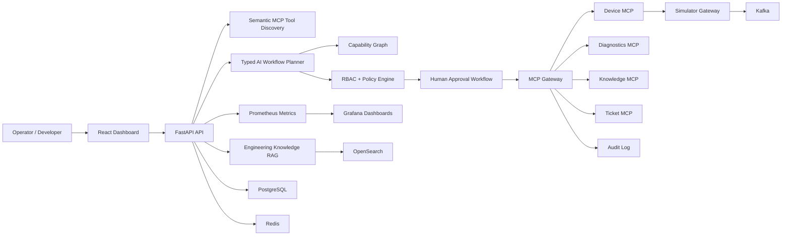

# MCP Engineering Operations Platform

An Enterprise AI Engineering Control Plane for governed developer operations across GitHub, CI/CD,
engineering documentation, tickets, approvals, simulated devices, and MCP tools.

The platform demonstrates a production-style AI architecture where a model can plan engineering
work, but cannot bypass tool governance. Natural-language requests are converted into typed,
policy-checked workflows that execute only through governed MCP tools.

## Problem

Modern engineering teams want natural-language operations such as:

> Check the latest failed build for payments-api, inspect the relevant commit changes and engineering documentation, create a ticket if the failure is code-related, prepare a staging deployment workflow after tests pass, and request my approval before execution.

The hard part is not asking an LLM to produce steps. The hard part is making sure the model cannot
bypass authentication, authorization, policy, approvals, audit, idempotency, or production safety
boundaries.

This project focuses on that control layer:

```text
natural language
-> semantic MCP tool discovery
-> engineering RAG
-> typed workflow DAG
-> capability graph validation
-> RBAC and policy evaluation
-> human approval where required
-> MCP execution
-> audit trail and metrics
```

## Architecture



## Service Map

- `apps/api`: FastAPI backend, AI orchestration APIs, workflow APIs, capability APIs, readiness, metrics.
- `apps/frontend`: React/Vite enterprise dashboard.
- `services/mcp-gateway`: governed MCP routing, RBAC, policy, approvals, rate limiting, idempotency, audit.
- `services/device-mcp`, `services/diagnostics-mcp`, `services/knowledge-mcp`, `services/ticket-mcp`,
  `services/repository-mcp`: domain MCP servers.
- `services/simulator-gateway`: deterministic 50-device engineering simulator.
- `packages/*`: shared schemas, policy, observability, events, approvals, search, and auth helpers.
- `evaluation`: deterministic benchmark datasets, runner, metrics, JSON/CSV/Markdown reports.

## What It Demonstrates

- **Governed MCP execution**: tool registry, permissions, risk classes, rate limits, idempotency,
  audit logging, and approval routing.
- **Gemini-backed AI planning**: live workflow planning, answer generation, and embeddings through
  provider abstractions, with deterministic fallback for CI.
- **Semantic MCP tool discovery**: the planner receives only relevant, role-authorized tools instead
  of the entire tool catalog.
- **Engineering RAG**: repository docs, CI/CD docs, deployment policies, service ownership, and MCP
  documentation are retrieved with citations before planning.
- **Typed workflow DAGs**: AI output is validated with Pydantic schemas, argument checks, DAG checks,
  RBAC checks, and policy checks before execution.
- **Capability graph constraints**: workflow paths are checked against resources, tools,
  environments, risk, and policy.
- **GitHub vertical slice**: failed-build investigation, workflow logs, commits, changed files, issue
  creation, and approval-gated workflow reruns.
- **Resilient execution**: checkpoints, retries, approval waits, compensation hooks, resume, and
  node-level retry.
- **MCP security hardening**: malicious metadata detection, prompt-injection containment,
  hallucinated-tool rejection, argument tampering checks, approval replay protection, and redaction.
- **Observability and evaluation**: Prometheus/Grafana plus a deterministic benchmark framework with
  330 enterprise engineering scenarios.

## AI And MCP Model

The LLM is deliberately not an authority. It receives a policy-filtered tool subset from semantic discovery and cited engineering evidence from RAG, then proposes a typed workflow. The backend validates every node, checks every tool against trusted registry metadata, evaluates RBAC and environment policy, inserts approval gates where required, and revalidates immediately before execution.

Trust boundary:

**AI recommends. Policy authorizes. Human approves. MCP executes. Audit records.**

That trust boundary is the core design principle. The model can propose a workflow, but trusted
backend services decide whether each tool exists, whether the actor is allowed to use it, whether the
target environment changes the risk, whether approval is required, and whether execution is safe.

## Governance And Security

Roles: `VIEWER`, `ENGINEER`, `OPERATOR`, `ADMIN`.

Examples:

- `VIEWER` can read devices, knowledge, and tickets.
- `ENGINEER` can diagnose and create/update tickets.
- `OPERATOR` can request device operations.
- `ADMIN` can approve according to policy, but self-approval is blocked.

High-risk and critical operations require approval. Approval is bound to workflow, node, tool, argument hash, actor, and expiration so replay or tampering does not authorize modified execution.

See [docs/security.md](docs/security.md) and [docs/threat-model.md](docs/threat-model.md).

## Quickstart

```bash
python -m pip install -e ".[dev]"
npm --prefix apps/frontend install
docker compose -f infra/docker/docker-compose.dev.yml up -d --build
```

Live GitHub/LLM demo settings:

```env
GITHUB_TOKEN=replace-with-fine-grained-github-token
GITHUB_OWNER=ImmanuelP31
GITHUB_REPO=MCP_AI
GITHUB_ALLOWED_REPOSITORIES=ImmanuelP31/MCP_AI,ImmanuelP31/mcp-ai-demo-target

GEMINI_API_KEY=your-valid-gemini-key
GEMINI_MODEL=gemini-3.5-flash
LLM_PLANNER_PROVIDER=gemini
LLM_PROVIDER=gemini
EMBEDDING_PROVIDER=gemini
GEMINI_EMBEDDING_MODEL=gemini-embedding-001

# Alternative live planner providers.
OPENROUTER_API_KEY=your-valid-openrouter-key
OPENROUTER_MODEL=openrouter/auto

TOOL_DISCOVERY_INDEX_BACKEND=opensearch
KNOWLEDGE_INDEX_BACKEND=opensearch
```

Keep the defaults below for tests and CI:

```env
LLM_PLANNER_PROVIDER=deterministic
EMBEDDING_PROVIDER=hashing
TOOL_DISCOVERY_INDEX_BACKEND=memory
KNOWLEDGE_INDEX_BACKEND=memory
```

Open the system:

- Frontend: http://localhost:8080
- API: http://localhost:18000
- Simulator Gateway: http://localhost:8001
- MCP Gateway: http://localhost:8002
- Prometheus: http://localhost:9090
- Grafana: http://localhost:3000

## Validation

```bash
python -m pytest -q
python -m ruff check .
python -m mypy apps packages services tests scripts evaluation
python -m bandit -c pyproject.toml -r apps packages services scripts tests evaluation
npm --prefix apps/frontend test -- --run
npm --prefix apps/frontend run lint
npm --prefix apps/frontend run typecheck
npm --prefix apps/frontend run build
npm --prefix apps/frontend run e2e
docker compose -f infra/docker/docker-compose.dev.yml config --quiet
docker compose -f infra/docker/docker-compose.dev.yml up -d --build
```

## Demo Workflow

Best five-minute demonstration:

1. Submit the natural-language request about the latest failed `payments-api` build.
2. Show semantic MCP discovery ranking CI/CD, repository, documentation, ticket, test, and deployment tools.
3. Show RAG citations for deployment procedure, required tests, service owner, and staging restrictions.
4. Show the generated workflow DAG and capability-graph path.
5. Show policy decisions, including approval required before staging execution.
6. Approve the operation as an authorized human.
7. Execute through MCP gateway.
8. Show audit trail, policy records, and Prometheus metrics.

See [docs/demo-guide.md](docs/demo-guide.md).
For the GitHub-backed demo slice, see [docs/github-demo-integration.md](docs/github-demo-integration.md)
and [docs/final-live-demo-runbook.md](docs/final-live-demo-runbook.md).

## Dashboard Views

- Fleet and system health dashboard.
- Semantic tool discovery debugger.
- Workflow DAG with policy decisions and approval state.
- Capability graph inspector.
- Engineering RAG search with citations.
- Approval center.
- Tool registry and governance view.
- Audit explorer.
- Evaluation metrics page.

## Evaluation

The deterministic benchmark currently contains 330 synthetic enterprise engineering scenarios. It reports tool recall/precision, workflow validity, hallucinated tool rate, RAG recall, approval classification, latency, and execution success across four configurations:

- all tools
- semantic retrieval
- semantic retrieval + RAG
- semantic retrieval + RAG + capability graph

The generated 330-case benchmark is a regression suite, not a substitute for live model evaluation.
The repository also includes a separate held-out adversarial dataset with 50 independently written
cases covering paraphrases, vague requests, impossible requests, distracting tools, conflicting
policies, multi-intent prompts, prompt injection, missing information, and ambiguous environments.

Run:

```bash
python -m evaluation.run --config semantic_rag_graph
python -m evaluation.run --config semantic_rag_graph --mode real --limit 3
```

See [docs/ai-evaluation.md](docs/ai-evaluation.md).

## Technology Stack

| Layer | Tools |
| --- | --- |
| Frontend | React, TypeScript, Vite, lucide-react |
| API | FastAPI, Pydantic, SQLAlchemy, Alembic |
| AI | Gemini planner, Gemini embeddings, deterministic CI fallback |
| MCP | Official Python MCP SDK, domain MCP servers, governed MCP gateway |
| Data | PostgreSQL, Redis, Kafka, OpenSearch |
| Observability | Prometheus, Grafana, structured logs, request/correlation IDs |
| DevOps | Docker Compose, pytest, Vitest, Playwright, ruff, mypy, Bandit |

## Implementation Status

| Area | Status |
| --- | --- |
| MCP gateway and domain servers | Implemented and covered by tests |
| GitHub failed-build vertical slice | Live validated against `ImmanuelP31/mcp-ai-demo-target` |
| Gemini workflow planner | Implemented; live 50-case held-out evaluation completed and labeled |
| Gemini embeddings | Implemented for live semantic retrieval; hashing remains the deterministic baseline |
| OpenSearch RAG adapter | Live validated locally for repository-document retrieval |
| 330-case benchmark | Deterministic/mock regression baseline |
| 50-case held-out adversarial benchmark | Live Gemini planner run completed: 5/50 valid workflows; failure taxonomy instrumentation added |
| Enterprise SSO/OIDC | Not implemented; JWT boundary is present for integration |
| Docker Compose | Local validation topology, not production deployment |

## Limitations

- Mock benchmark results are deterministic; live Gemini benchmark results are labeled separately with provider/model provenance.
- Live LLM planning and live embeddings now use Gemini for the recommended demo path. OpenAI remains a legacy-compatible provider in code, but no OpenAI key is required for the current live demo.
- `HashingEmbeddingProvider` is a deterministic feature-hashing retrieval baseline with synonym expansion, not a learned semantic embedding model.
- Deterministic planner confidence values are heuristic hints, not calibrated model-confidence estimates.
- Real-mode evaluation fails closed on embedding-provider errors instead of silently falling back to hashing.
- OpenSearch-backed repository-document RAG was live validated locally with `OPENSEARCH_URL=http://localhost:9200`; Docker-internal service names such as `http://opensearch:9200` are for containers, not host-run scripts.
- Live GitHub failed-build investigation was validated against the dedicated demo target `ImmanuelP31/mcp-ai-demo-target` with the controlled failing workflow, issue creation, approval-gated rerun request, approval, and rerun execution.
- The local simulator and synthetic engineering corpus are demo/pilot assets.
- Enterprise identity federation is represented by signed JWT validation; production OIDC/JWKS integration should be wired to the same authenticator boundary.
- Docker Compose is for local validation, not a production deployment topology.
