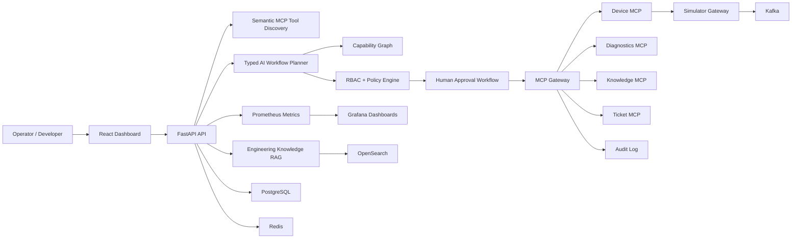

# MCP Engineering Operations Platform

Enterprise AI Engineering Control Plane for governed engineering automation across devices, repositories, CI/CD workflows, documentation, tickets, approvals, and MCP tools.

## Problem Statement

Modern engineering teams want natural-language operations such as:

> Check the latest failed build for payments-api, inspect the relevant commit changes and engineering documentation, create a ticket if the failure is code-related, prepare a staging deployment workflow after tests pass, and request my approval before execution.

The hard part is not asking an LLM to produce steps. The hard part is making sure the model cannot bypass authentication, authorization, policy, approvals, audit, idempotency, or production safety boundaries.

## Architecture



Core services:

- `apps/api`: FastAPI backend, AI orchestration APIs, workflow APIs, capability APIs, readiness, metrics.
- `apps/frontend`: React/Vite enterprise dashboard.
- `services/mcp-gateway`: governed MCP routing, RBAC, policy, approvals, rate limiting, idempotency, audit.
- `services/device-mcp`, `services/diagnostics-mcp`, `services/knowledge-mcp`, `services/ticket-mcp`: domain MCP servers.
- `services/simulator-gateway`: deterministic 50-device engineering simulator.
- `packages/*`: shared schemas, policy, observability, events, approvals, search, and auth helpers.
- `evaluation`: deterministic benchmark datasets, runner, metrics, JSON/CSV/Markdown reports.

## Major Features

- Governed MCP gateway with tool registry, permissions, risk classes, rate limits, idempotency, and audit.
- GitHub-backed repository/CI tools for failed-build investigation, commit inspection, issue creation, and approval-gated workflow reruns.
- Semantic MCP tool discovery so the planner receives only relevant, authorized tools.
- Engineering Knowledge RAG over repository, CI/CD, deployment, ownership, testing, and MCP documentation.
- Typed AI-generated workflow DAGs with schema validation, graph validation, argument validation, and policy validation.
- Policy-constrained workflow transformation: AI recommends, policy authorizes, human approves, MCP executes, audit records.
- Capability graph for policy-compliant paths across repositories, pipelines, deployments, tickets, documentation, MCP servers, and tools.
- Resilient workflow execution with checkpoints, retries, approval waits, compensation, resume, and node-level retry.
- MCP-specific security hardening for malicious metadata, prompt injection, hallucinated tools, argument tampering, approval replay, and sensitive-data redaction.
- Prometheus metrics and Grafana dashboard provisioning.
- Deterministic mock evaluation framework with 330 enterprise engineering scenarios.

## AI And MCP Model

The LLM is deliberately not an authority. It receives a policy-filtered tool subset from semantic discovery and cited engineering evidence from RAG, then proposes a typed workflow. The backend validates every node, checks every tool against trusted registry metadata, evaluates RBAC and environment policy, inserts approval gates where required, and revalidates immediately before execution.

Trust boundary:

**AI recommends. Policy authorizes. Human approves. MCP executes. Audit records.**

## Governance And Security

Roles: `VIEWER`, `ENGINEER`, `OPERATOR`, `ADMIN`.

Examples:

- `VIEWER` can read devices, knowledge, and tickets.
- `ENGINEER` can diagnose and create/update tickets.
- `OPERATOR` can request device operations.
- `ADMIN` can approve according to policy, but self-approval is blocked.

High-risk and critical operations require approval. Approval is bound to workflow, node, tool, argument hash, actor, and expiration so replay or tampering does not authorize modified execution.

See [docs/security.md](docs/security.md) and [docs/threat-model.md](docs/threat-model.md).

## Setup

```bash
python -m pip install -e ".[dev]"
npm --prefix apps/frontend install
docker compose -f infra/docker/docker-compose.dev.yml up -d --build
```

Local URLs:

- Frontend: http://localhost:8080
- API: http://localhost:18000
- Simulator Gateway: http://localhost:8001
- MCP Gateway: http://localhost:8002
- Prometheus: http://localhost:9090
- Grafana: http://localhost:3000

## Validation

```bash
python -m pytest -q
python -m ruff check .
python -m mypy apps packages services tests scripts evaluation
python -m bandit -c pyproject.toml -r apps packages services scripts tests evaluation
npm --prefix apps/frontend test -- --run
npm --prefix apps/frontend run lint
npm --prefix apps/frontend run typecheck
npm --prefix apps/frontend run build
npm --prefix apps/frontend run e2e
docker compose -f infra/docker/docker-compose.dev.yml config --quiet
docker compose -f infra/docker/docker-compose.dev.yml up -d --build
```

## Demo Workflow

Polished demonstration:

1. Submit the natural-language request about the latest failed `payments-api` build.
2. Show semantic MCP discovery ranking CI/CD, repository, documentation, ticket, test, and deployment tools.
3. Show RAG citations for deployment procedure, required tests, service owner, and staging restrictions.
4. Show the generated workflow DAG and capability-graph path.
5. Show policy decisions, including approval required before staging execution.
6. Approve the operation as an authorized human.
7. Execute through MCP gateway.
8. Show audit trail and Prometheus metrics.

See [docs/demo-guide.md](docs/demo-guide.md).
For the GitHub-backed demo slice, see [docs/github-demo-integration.md](docs/github-demo-integration.md).

## Screenshots

Screenshot placeholders for portfolio/demo documentation:

- Dashboard fleet and system health.
- Tool discovery ranking view.
- Workflow DAG with policy decisions.
- Approval center.
- Audit explorer.
- Evaluation metrics page.

## Evaluation

The deterministic benchmark currently contains 330 synthetic enterprise engineering scenarios. It reports tool recall/precision, workflow validity, hallucinated tool rate, RAG recall, approval classification, latency, and execution success across four configurations:

- all tools
- semantic retrieval
- semantic retrieval + RAG
- semantic retrieval + RAG + capability graph

Run:

```bash
python -m evaluation.run --config semantic_rag_graph
```

See [docs/ai-evaluation.md](docs/ai-evaluation.md).

## Limitations

- Current benchmark results are deterministic mock results unless a live model provider is configured.
- The local simulator and synthetic engineering corpus are demo/pilot assets.
- Enterprise identity federation is represented by signed JWT validation; production OIDC/JWKS integration should be wired to the same authenticator boundary.
- Docker Compose is for local validation, not a production deployment topology.
