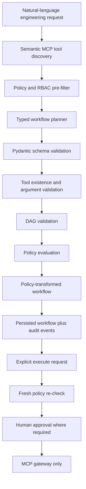
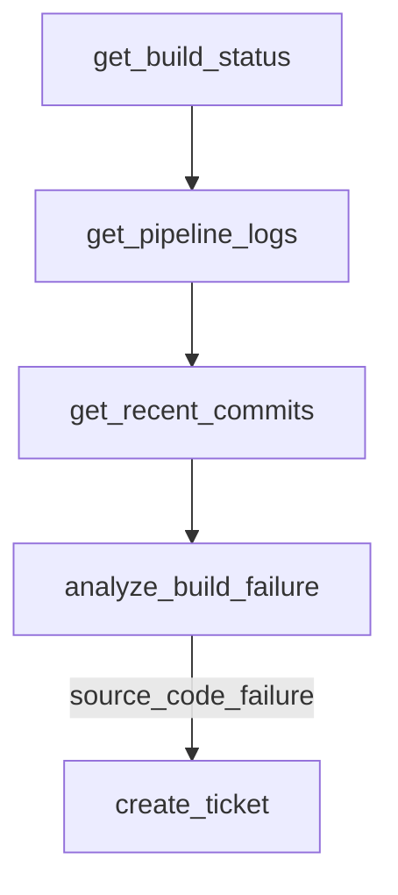
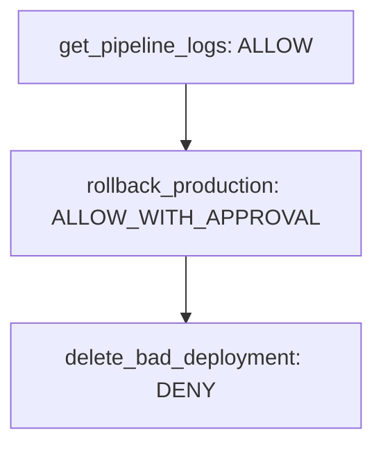

# AI-Generated Engineering Workflow DAGs

This feature turns a natural-language engineering request into a validated, policy-transformed
workflow DAG before any execution happens. The planner does not receive the full MCP catalog. It only
receives tools returned by semantic tool discovery after role and policy filtering.

Trust boundary: **AI recommends. Policy authorizes. Human approves. MCP executes. Audit records.**



## Example

Request:

```json
{
  "user_request": "Check why the latest build failed and create a ticket if the problem comes from our code.",
  "role": "ENGINEER",
  "created_by": "engineer",
  "top_k": 10
}
```

Possible validated workflow:



The exact nodes depend on the policy-filtered tools retrieved for the request.

## Planner Modes

Default test/local mode:

```env
LLM_PLANNER_PROVIDER=deterministic
```

Live demo mode:

```env
GEMINI_API_KEY=your-valid-gemini-key
GEMINI_MODEL=gemini-2.5-flash
LLM_PLANNER_PROVIDER=gemini
```

OpenRouter remains supported for planner comparison by setting `OPENROUTER_API_KEY` and
`LLM_PLANNER_PROVIDER=openrouter`.

`LLMWorkflowPlanner` calls the provider for JSON only, then normalizes common response shapes
(`nodes`, `steps`, or `tool_sequence`) into the strict `WorkflowPlanDraft` schema. That normalized
draft is still untrusted. The backend validator then checks tool existence, discovered-tool
membership, arguments, DAG structure, size limits, RBAC, risk, and approval policy.

Policy can transform a proposed plan:



Supported policy outcomes:

- `ALLOW`
- `ALLOW_WITH_APPROVAL`
- `DENY`
- `REQUIRE_ADDITIONAL_CONTEXT`

Every workflow node includes a policy evaluation record with actor, role, tool, target resource,
environment, trusted risk, policy decision, matched rule, reason, and timestamp.

## API

Plan without executing:

```http
POST /api/v1/workflows/plan
Content-Type: application/json

{
  "user_request": "Create a maintenance ticket for SIM-014.",
  "role": "ENGINEER",
  "created_by": "engineer",
  "target_environment": "production",
  "top_k": 20
}
```

Read workflow state:

```http
GET /api/v1/workflows/{workflow_id}
```

Execute an existing workflow:

```http
POST /api/v1/workflows/{workflow_id}/execute
Content-Type: application/json

{
  "role": "OPERATOR"
}
```

Cancel:

```http
POST /api/v1/workflows/{workflow_id}/cancel
```

## Security Guarantees

- Tool discovery happens before planning, so the planner only sees relevant authorized tools.
- Planner output is a strict Pydantic model, not free-form text.
- Live LLM output is schema-normalized only to tolerate JSON shape differences; trusted risk,
  approval, retry, timeout, executable status, and server metadata still come from the backend
  registry.
- Validation rejects unknown tools, undiscovered tools, disabled tools, invalid arguments, cycles,
  missing dependencies, and oversized workflows.
- Policy evaluation determines `ALLOW`, `ALLOW_WITH_APPROVAL`, `DENY`, or
  `REQUIRE_ADDITIONAL_CONTEXT`.
- Environment-aware policy supports different decisions for `dev`, `staging`, and `production`.
- The model cannot set trusted authorization fields such as `authorized=true`, `approval=false`, or
  `risk_level=LOW`; risk and approval requirements are derived from backend policy metadata.
- High-risk and critical tools are marked approval-required only by trusted policy.
- Planning and execution are separate operations.
- Policy is re-evaluated immediately before execution to prevent stale decisions.
- Execution goes through the MCP gateway. The workflow service does not directly call databases,
  Kafka, Redis, OpenSearch, shell commands, or simulator internals.
- Model-supplied approval tokens and authorization fields remain untrusted by the gateway.

## Persistence

Workflows are represented by these PostgreSQL tables:

- `workflows`
- `workflow_nodes`
- `workflow_edges`

Workflow records also store the original AI plan, policy-transformed plan, node policy evaluations,
and workflow audit events.

The Alembic migration is:

- `apps/api/alembic/versions/2026_08_11_0003_workflow_dag.py`

## Metrics

- `ai_workflows_planned_total`
- `ai_workflow_plan_failures_total`
- `ai_workflow_nodes_total`
- `ai_workflow_planning_latency_seconds`
- `ai_workflow_validation_failures_total`
- `policy_evaluations_total`
- `policy_denials_total`
- `policy_approval_required_total`
- `policy_bypass_attempts_total`
