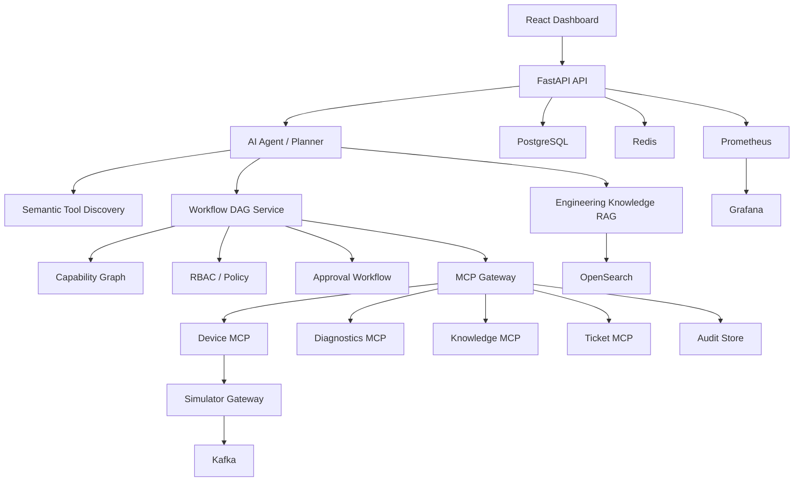
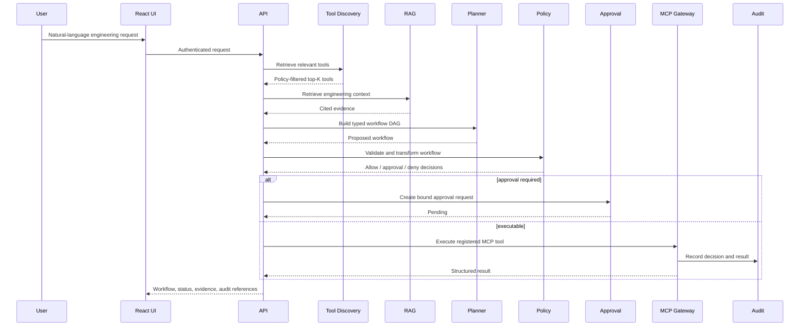

# Architecture

## Purpose

The platform is an Enterprise AI Engineering Control Plane: a governed layer that lets engineers ask natural-language questions and request engineering actions while preserving MCP tool boundaries, policy enforcement, human approvals, auditability, and observability.

## Runtime Components

## Request Flow

## Data Architecture

PostgreSQL is the source of truth for the domain schema, workflow persistence, gateway persistence, audit, approvals, idempotency, and rate limits. Alembic owns schema evolution; application startup does not use `create_all()`.

Redis is used for runtime acceleration where available. Kafka carries telemetry and workflow-style events. OpenSearch backs engineering knowledge/log retrieval with deterministic local fallbacks for tests and degraded mode. Prometheus scrapes API and service metrics, and Grafana provides dashboards.

## MCP Boundary

Domain MCP servers expose typed tools. The MCP gateway is the only production routing point for tool execution. Tools are registered with normalized metadata: server, category, description, risk, permissions, roles, schema, tags, resource types, retry/idempotency settings, and optional compensation.

## Health And Readiness

Readiness checks now cover:

- API process
- PostgreSQL
- Redis
- Kafka
- OpenSearch
- Device MCP
- Diagnostics MCP
- Knowledge MCP
- Ticket MCP
- model provider configuration
- MCP gateway registry/stores
- simulator registry and event processors

Docker Compose healthchecks validate API, gateway, simulator, PostgreSQL, Redis, Kafka, and OpenSearch.

## Backward Compatibility

Direct tool calls still flow through the existing MCP gateway contract. New AI workflow functionality adds typed planning, policy transformation, capability guidance, RAG evidence, and recovery around the gateway rather than replacing it.
