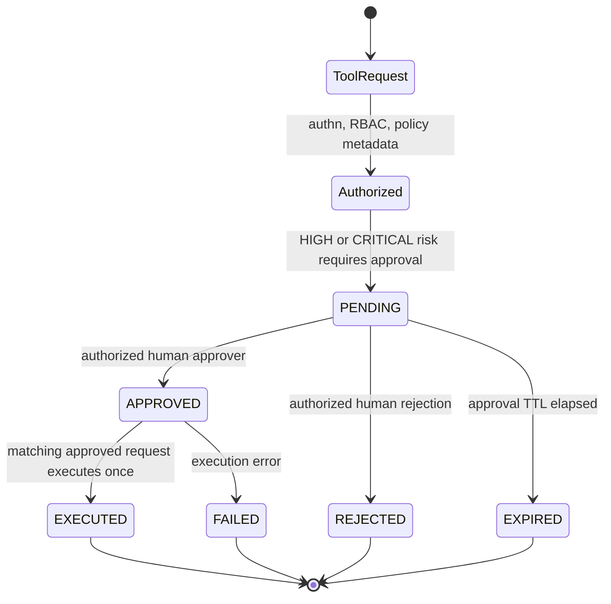

# Approval Workflow Diagram

## Phase 13 Instance

| Transition | Actor | Audit Result |
| --- | --- | --- |
| `restart_service` requested | `operator-1` | `PENDING_APPROVAL` |
| `approval.requested` | `operator-1` | `PENDING` |
| `approval.approved` | `admin-1` | `APPROVED` |
| `approval.executed` | `operator-1` | `EXECUTED` |
| `restart_service` result | `operator-1` | `SUCCEEDED` |

The deterministic demo approval ID is
`11a1704f-6ca6-51fd-b4ad-1f34e65f006a`.
