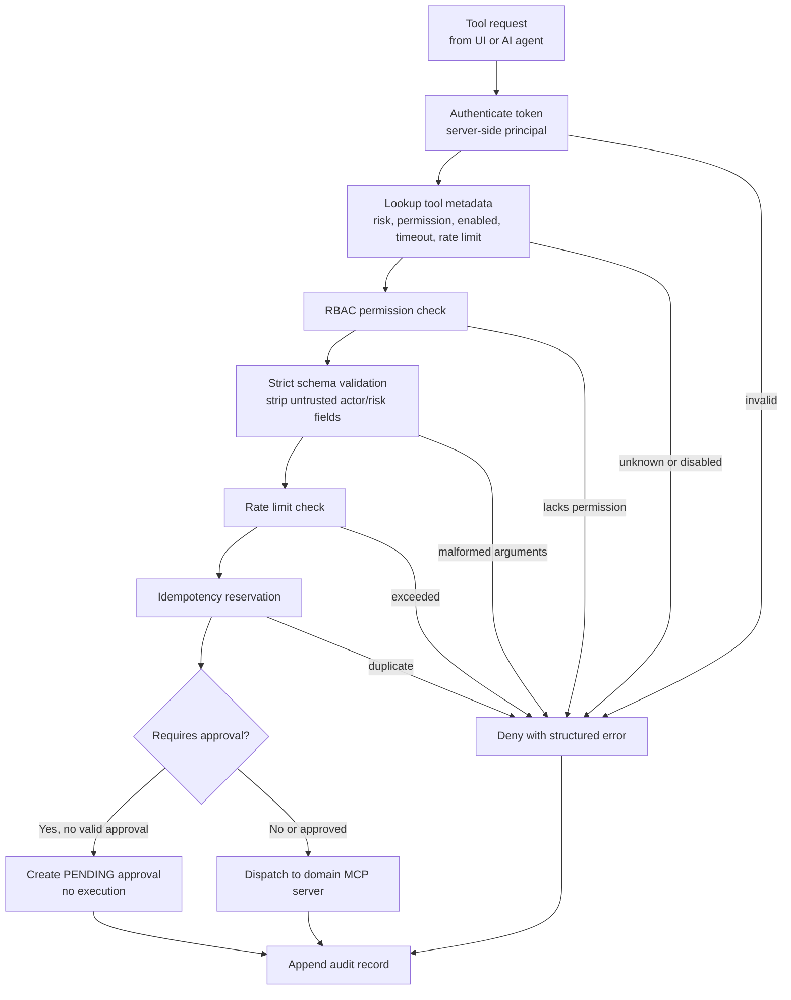

# Security Model Diagram

## Controls Demonstrated

| Control | Demo Evidence |
| --- | --- |
| Authentication | `operator-token`, `admin-token`, and `ai-token` resolve server-side principals. |
| Authorization | `restart_service` checks `devices:operate`. |
| AI isolation | The AI agent calls only the MCP gateway. |
| Approval separation | `operator-1` requests; `admin-1` approves. |
| Input validation | Tool arguments are strict Pydantic schemas. |
| Audit | Every allow, pending approval, approval, execution, and denial path writes audit data. |
