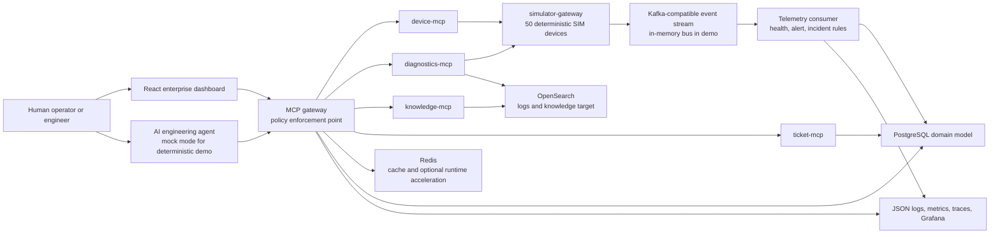

# System Architecture Diagram

## Demo Boundaries

The Phase 13 scripts run the same domain services and gateway policy code in process with
deterministic in-memory stores. Production-mode gateway startup wires signed JWT validation
and SQL-backed approval, audit, idempotency, and rate-limit stores. The production boundary
remains unchanged: production MCP tool calls must route through the MCP gateway.
