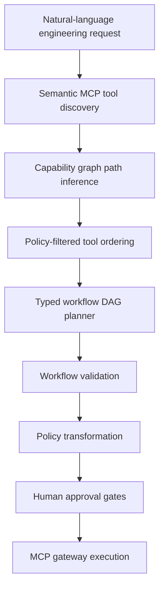

# Enterprise MCP Capability Graph

The capability graph represents how enterprise engineering resources can be transformed or inspected through governed MCP tools. It helps the planner answer: "What tools and intermediate resources are required to move from the user's current state to the requested goal?"

This feature intentionally stays in the engineering automation domain: repositories, CI/CD pipelines, deployments, services, tickets, documentation, users, roles, MCP servers, and MCP tools.

## Implementation Choice

The current implementation uses an in-process adjacency-list graph built from the existing MCP tool registry plus explicit tool resource declarations.

Neo4j is not introduced because the first production-reasonable need is bounded pathfinding over the registered tool catalog, not multi-hop graph analytics over millions of entities. The model can later be persisted in PostgreSQL adjacency tables if graph editing, tenant-specific capability overlays, or audit history require database-backed graph state.

## Core Entities

`ResourceNode`

- `id`
- `type`
- `name`
- `metadata`
- `environment`

`CapabilityEdge`

- `source_type`
- `destination_type`
- `tool_name`
- `mcp_server`
- `cost`
- `risk`
- `prerequisites`
- `enabled`

Tools can declare:

- `input_resource_types`
- `output_resource_types`
- `preconditions`
- `risk`
- `cost_weight`

If explicit declarations are absent, the graph service uses curated mappings for existing engineering MCP tools.

## Queries

Implemented in `services/ai-agent/src/mcp_ops_ai_agent/capabilities/service.py`.

- Find tools reachable from a resource.
- Find resources affected by a tool.
- Find shortest capability path.
- Find lowest-risk capability path.
- Find policy-compliant capability path.

The default strategy is `policy_compliant`.

## API

Return graph snapshot:

```http
GET /api/v1/capabilities/graph
```

Find a path:

```http
POST /api/v1/capabilities/path
Content-Type: application/json

{
  "source": "repository:payments-api",
  "goal": "create_issue_for_latest_failed_build",
  "role": "OPERATOR",
  "environment": "staging",
  "strategy": "policy_compliant"
}
```

Example path:

```text
repository
-> get_build_status
-> build_pipeline
-> get_failed_jobs
-> failed_build
-> get_pipeline_logs
-> build_logs
-> analyze_build_failure
-> failure_analysis
-> create_ticket
-> ticket
```

Evaluate graph-constrained planning:

```http
GET /api/v1/capabilities/evaluate
```

## Planner Integration

The workflow planner now uses this order:



The capability graph does not authorize execution by itself. It asks the existing workflow policy evaluator whether candidate tool edges are allowed, approval-gated, denied, or unavailable for the actor, role, and environment.

## Security Boundary

AI proposes goals and candidate plans. The capability graph constrains possible routes using registered MCP tools. Policy authorizes. Human approval gates high-risk operations. MCP executes. Audit records.

No LLM output is trusted for:

- authorization status
- risk level
- approval requirement
- server enabled state
- tool existence

## How It Reduces Invalid Workflows

LLM-only planning can hallucinate intermediate resources or jump directly from a repository to an unsupported action. The capability graph forces planning through declared tool edges, so the planner receives a smaller set of valid steps and can be evaluated against:

- valid tool sequence rate
- hallucinated tool rate
- policy violation rate
- unnecessary tool count

The deterministic benchmark lives in `services/ai-agent/src/mcp_ops_ai_agent/capabilities/evaluation.py`.

## Frontend

The React console includes a capability inspector at `/capabilities`.

It supports:

- selecting a source resource
- selecting a goal
- choosing environment and path strategy
- viewing the selected path
- inspecting related MCP tools
- seeing risk and policy-compliance status
