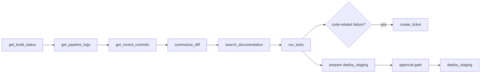

# Demo Guide

## Start

```bash
docker compose -f infra/docker/docker-compose.dev.yml up -d --build
```

Open:

- Frontend: http://localhost:8080
- API readiness: http://localhost:18000/ready
- MCP gateway readiness: http://localhost:8002/ready
- Simulator readiness: http://localhost:8001/ready
- Prometheus: http://localhost:9090
- Grafana: http://localhost:3000

## Polished Demonstration

User request:

> Check the latest failed build for payments-api, inspect the relevant commit changes and engineering documentation, create a ticket if the failure is code-related, prepare a staging deployment workflow after tests pass, and request my approval before execution.

GitHub-backed variant for this repository:

> Check why the latest GitHub build failed and create a GitHub issue if the problem comes from our code. Ask for approval before rerunning the workflow.

### 1. Natural Language Entry

Open the dashboard and submit the request through the AI/workflow surface.

Expected explanation:

- the platform treats the request as an engineering workflow
- the AI planner does not receive every MCP tool
- policy and approval remain backend-controlled

### 2. Semantic Tool Discovery

Show the tool discovery/debug view.

Expected relevant tools include:

- `get_latest_failed_build`
- `get_build_status`
- `get_pipeline_logs`
- `get_job_logs`
- `get_commit_history`
- `get_recent_commits`
- `summarize_diff`
- `create_issue`
- `search_documentation`
- `run_tests`
- `create_ticket`
- `deploy_staging`
- `rerun_workflow`

### 3. Engineering RAG

Show retrieved engineering documents.

Expected evidence includes deployment procedure, required tests, service ownership, staging rules, and engineering documentation citations.

### 4. Workflow DAG

Show the planned DAG:



### 5. Capability Graph And Policy

Show that the graph path moves through repository, pipeline, failed build, build logs, ticket, tests, and staging deployment. Show policy decisions on each node:

- read-only CI/CD and documentation tools are allowed
- ticket creation is medium risk
- staging deployment requires approval
- production or destructive tools are not allowed unless policy permits them

### 6. Approval

Show the approval center with operation, requester, risk, reason, expiry, and status. Approve as an authorized human account.

### 7. MCP Execution

Execute the approved workflow. Show node-level status, retries/checkpoints if relevant, and final structured results.

### 8. Audit And Metrics

Show audit records for:

- original AI plan
- policy-transformed plan
- approval request
- approval decision
- MCP execution

Show Prometheus/Grafana metrics for API requests, MCP calls, policy decisions, workflow planning, workflow execution, RAG, tool discovery, and security events.

For live GitHub setup and required token permissions, see `docs/github-demo-integration.md`.

## CLI Validation Commands

```bash
python -m pytest -q
npm --prefix apps/frontend run e2e
python -m evaluation.run --config semantic_rag_graph
docker compose -f infra/docker/docker-compose.dev.yml ps
```
