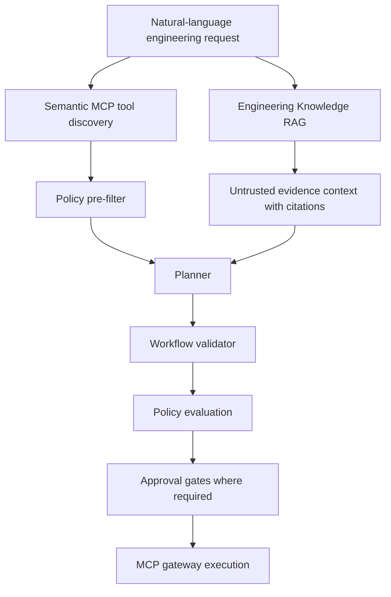

# Engineering Knowledge RAG

The Engineering Knowledge RAG layer retrieves internal engineering context before workflow planning. It is focused on CI/CD, repositories, deployments, service ownership, API docs, run instructions, testing policy, environment restrictions, MCP tool documentation, and engineering standards.

It is not a cybersecurity incident RAG system.

## Planning Flow



Trust boundary: retrieved documents are evidence only. They cannot lower risk, change authorization, bypass approvals, override environment policy, or mark a tool as allowed.

## Implementation

Core files:

- `services/ai-agent/src/mcp_ops_ai_agent/engineering_rag/models.py`
- `services/ai-agent/src/mcp_ops_ai_agent/engineering_rag/corpus.py`
- `services/ai-agent/src/mcp_ops_ai_agent/engineering_rag/ingestion.py`
- `services/ai-agent/src/mcp_ops_ai_agent/engineering_rag/index.py`
- `services/ai-agent/src/mcp_ops_ai_agent/engineering_rag/retrieval.py`
- `services/ai-agent/src/mcp_ops_ai_agent/engineering_rag/service.py`
- `services/ai-agent/src/mcp_ops_ai_agent/engineering_rag/evaluation.py`

The local implementation uses deterministic hashing embeddings and BM25-style lexical scoring so tests do not require live LLM or OpenSearch access. `OpenSearchKnowledgeIndex` defines the production boundary for OpenSearch-backed vector/BM25 storage and falls back safely in this local runtime.

## API

Search:

```http
POST /api/v1/knowledge/search
Content-Type: application/json

{
  "query": "Deploy payments-api to staging",
  "top_k": 5,
  "mode": "hybrid",
  "environment": "staging"
}
```

Response results include:

- `citation_id`
- document metadata
- `lexical_score`
- `semantic_score`
- `combined_score`
- `reason`
- `classification = UNTRUSTED_RETRIEVED_EVIDENCE`
- `prompt_injection_detected`

Evaluation:

```http
GET /api/v1/knowledge/evaluate
```

Returns Recall@5, Precision@5, and MRR for BM25, vector, and hybrid retrieval.

## Synthetic Corpus

The demo corpus covers 10 services and repositories:

- `payments-api`
- `orders-api`
- `inventory-api`
- `billing-worker`
- `identity-service`
- `notifications-api`
- `search-service`
- `analytics-pipeline`
- `reporting-api`
- `gateway-service`

It also includes CI/CD standards, staging and production environment policies, testing policy, run instructions, and approved deployment MCP tool references.

## Workflow Provenance

Workflow planning stores:

- retrieved RAG evidence in `workflow.original_plan.retrieved_knowledge`
- a `rag_boundary` statement in `workflow.original_plan`
- node-level `knowledge_references` for citations such as `ENG-POLICY-14` and `PAYMENTS-DEPLOY-03`

The frontend workflow planner shows retrieved documents, scores, sources, and why each document was selected.

## Metrics

- `rag_queries_total`
- `rag_query_latency_seconds`
- `rag_empty_results_total`
- `rag_documents_retrieved_total`

Prompt-injection-like content in retrieved documents is flagged through the existing control-plane metric:

- `mcp_prompt_injection_detections_total{source="rag_document"}`

## Limitations

The local embedding provider is deterministic and suitable for repeatable tests, not semantic quality benchmarking against a production embedding model. OpenSearch is represented by an adapter boundary and deterministic fallback in this environment. Retrieved documentation can be stale or conflicting, so the planner retains citations and the policy engine remains the source of enforcement.
