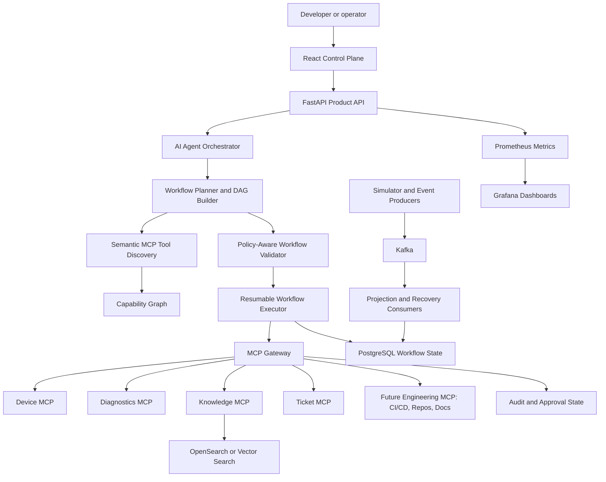

# Enterprise AI Engineering Control Plane Roadmap

Date: 2026-08-11

This roadmap evolves the existing MCP Engineering Operations Platform into an Enterprise AI Engineering Control Plane. It is intentionally not a greenfield rewrite and does not turn the product into a cybersecurity SOC. The target domain is engineering automation: CI/CD workflows, repositories, tickets, documentation, service ownership, approvals, policy-governed execution, and AI-assisted operational planning.

## Current Test Baseline

Validated locally on Windows from `C:\Users\Imman\OneDrive\Desktop\MCP PROJECT`.

| Area | Command | Result |
| --- | --- | --- |
| Backend tests | `python -m pytest` | 209 passed |
| Frontend lint | `npm run lint` in `apps/frontend` | passed |
| Frontend unit tests | `npm test` in `apps/frontend` | 1 file, 4 tests passed |
| Frontend production build | `npm run build` in `apps/frontend` | passed |
| Frontend E2E smoke | `npm run e2e` in `apps/frontend` | 1 Playwright test passed |

## Current Architecture

### Repository Layout

| Path | Purpose |
| --- | --- |
| `apps/api` | FastAPI product API, agent chat endpoint, health/readiness, observability middleware, SQLAlchemy models, repositories, seed data, Alembic migrations |
| `apps/frontend` | React/TypeScript enterprise console with login role selection, dashboard, device views, diagnostics, incidents, tickets, knowledge, approvals, tools, audit, system health, and assistant page |
| `services/ai-agent` | Governed LLM/agent orchestration service with intent parsing, deterministic routing, MCP gateway client, provider abstraction, citations, confidence, escalation, and benchmark evaluation |
| `services/mcp-gateway` | Policy enforcement point for MCP tool requests, authentication, RBAC, metadata checks, rate limiting, idempotency, approvals, audit, dispatch to domain MCP servers |
| `services/device-mcp` | Device MCP tool server wrapper around `DeviceDomainService` |
| `services/diagnostics-mcp` | Diagnostics MCP tool server wrapper around `DiagnosticsDomainService` |
| `services/knowledge-mcp` | Knowledge MCP tool server wrapper around `KnowledgeDomainService` |
| `services/ticket-mcp` | Ticket MCP tool server wrapper around `TicketDomainService` |
| `services/simulator-gateway` | Deterministic 50-device simulator, scenario controller, telemetry producer, event bus, health/alert/incident consumer logic |
| `services/event-processor` | Placeholder README for future Kafka-backed event processors |
| `packages/auth` | Role and permission model |
| `packages/policy` | MCP tool registry and risk metadata |
| `packages/mcp` | Shared MCP schemas, dispatcher, domain services, diagnostics engine, knowledge repository |
| `packages/observability` | JSON logging, sanitization, request/correlation/trace context, Prometheus metrics, FastAPI middleware |
| `packages/schemas` | Shared event and approval schemas |
| `infra` | Docker Compose, PostgreSQL SQL migrations, Kafka topics, OpenSearch template, Prometheus config, Grafana dashboards |
| `tests` | Unit, contract, integration, and security tests |

### FastAPI Entry Points

| File | Entry point | Notes |
| --- | --- | --- |
| `apps/api/src/mcp_ops_api/main.py` | `app` | Product API. Exposes `/health`, `/ready`, `/agent/chat`, `/agent/evaluate`, and `/metrics` through observability middleware. |
| `services/mcp-gateway/src/mcp_ops_mcp_gateway/app.py` | `app`, `create_app()` | MCP gateway FastAPI shell. In production mode wires JWT auth and SQLAlchemy-backed approvals, audit, rate limits, and idempotency. |
| `services/simulator-gateway/src/mcp_ops_simulator/app.py` | `app`, `create_app()` | Simulator API. Exposes device registry, scenarios, telemetry publish/process, and event inspection. |

### Database Model and Migrations

SQLAlchemy models live in `apps/api/src/mcp_ops_api/db/models.py`. They cover:

- identity and authorization data: `users`, `roles`, `permissions`, `user_roles`, `role_permissions`
- fleet data: `devices`, `device_services`, `telemetry`, `alerts`
- operations data: `incidents`, `incident_events`, `diagnostic_runs`, `tickets`
- governance data: `approvals`, `audit_logs`, `tool_executions`, `operation_requests`
- knowledge data: `knowledge_documents`

Alembic migrations live in `apps/api/alembic/versions`:

- `0001_create_domain_model`: core domain tables, UUIDs, constraints, indexes, cascades
- `0002_gateway_persistence`: gateway approvals, approval events, audit records, idempotency keys, and rate-limit call windows

Raw Docker initialization SQL also exists in `infra/postgres/migrations`. This duplicates Alembic schema intent and should be treated carefully.

### MCP Gateway

Core implementation:

- `services/mcp-gateway/src/mcp_ops_mcp_gateway/service.py`
- `services/mcp-gateway/src/mcp_ops_mcp_gateway/stores.py`
- `services/mcp-gateway/src/mcp_ops_mcp_gateway/persistence.py`
- `services/mcp-gateway/src/mcp_ops_mcp_gateway/auth.py`
- `services/mcp-gateway/src/mcp_ops_mcp_gateway/models.py`

The gateway already enforces:

- unknown/disabled tool rejection
- token authentication in local mode and HMAC JWT authentication for production mode
- RBAC via `packages/auth`
- tool metadata via `packages/policy`
- rate limiting
- idempotency
- approval creation and execution
- self-approval prevention
- AI-principal approval prevention
- audit records
- argument validation through domain MCP schemas
- stripping untrusted model-supplied authorization fields

### MCP Server Implementations

Each MCP server builds `ToolDefinition` objects using shared schemas and services:

- `services/device-mcp/src/mcp_ops_device_mcp/server.py`
- `services/diagnostics-mcp/src/mcp_ops_diagnostics_mcp/server.py`
- `services/knowledge-mcp/src/mcp_ops_knowledge_mcp/server.py`
- `services/ticket-mcp/src/mcp_ops_ticket_mcp/server.py`

The shared dispatcher is `packages/mcp/src/mcp_ops_mcp/dispatcher.py`. It exposes `list_tools`, validates typed inputs, checks gateway-injected actor context, handles disabled/unavailable/timeout test modes, and returns structured MCP results.

### Tool Registry, Policy, and RBAC

Tool metadata is centralized in `packages/policy/src/mcp_ops_policy/tool_registry.py` with:

- `tool_name`
- `domain`
- `description`
- `risk_level`
- `required_permission`
- `requires_approval`
- `timeout_seconds`
- `rate_limit`
- `enabled`

RBAC is centralized in `packages/auth/src/mcp_ops_auth/rbac.py` with roles `VIEWER`, `ENGINEER`, `OPERATOR`, and `ADMIN`.

### Approval Workflow and Audit

Approval state exists in both:

- in-memory deterministic stores in `stores.py`
- SQLAlchemy persistent stores in `persistence.py`

States: `PENDING`, `APPROVED`, `REJECTED`, `EXPIRED`, `EXECUTED`, `FAILED`.

Audit records are captured for gateway calls and approval transitions. Security tests cover bypass attempts, viewer/operator/admin boundaries, self-approval prevention, AI approval denial, duplicate operations, and gateway-only execution assumptions.

### LLM and Agent

Agent implementation:

- `services/ai-agent/src/mcp_ops_ai_agent/service.py`
- `services/ai-agent/src/mcp_ops_ai_agent/provider.py`
- `services/ai-agent/src/mcp_ops_ai_agent/routing.py`
- `services/ai-agent/src/mcp_ops_ai_agent/evaluation.py`
- `services/ai-agent/src/mcp_ops_ai_agent/gateway.py`
- `services/ai-agent/src/mcp_ops_ai_agent/models.py`

Current capabilities:

- bounded natural-language intent parsing
- deterministic mock provider for tests and demos
- optional Gemini chat provider for answer generation using sanitized context
- gateway-only tool execution
- selected tool route explanations
- confidence scores
- escalation flags
- citations from knowledge documents
- agent decision metrics
- benchmark endpoint for intent, route, outcome, escalation, hallucinated tool-call count, and tool failure rate

### Kafka, Redis, and OpenSearch

Current status:

- Kafka appears in Docker Compose and settings.
- Simulator has a `KafkaEventPublisher` adapter and an in-memory event bus.
- Telemetry consumer logic is implemented in process and is idempotent by event ID.
- Redis appears in settings, Docker Compose, and observability metrics, but no Redis-backed store is currently wired into the gateway. Gateway production persistence currently uses SQLAlchemy for rate limits and idempotency.
- OpenSearch appears in settings, Docker Compose, index template, docs, and latency metrics, but there is no production OpenSearch client or indexer yet.

### Prometheus and Grafana

Prometheus metrics live in `packages/observability/src/mcp_ops_observability/metrics.py`. FastAPI apps expose `/metrics` through `packages/observability/src/mcp_ops_observability/fastapi.py`.

Grafana dashboards live in `infra/grafana/provisioning/dashboards` for API, MCP, devices, Kafka, and infrastructure.

Prometheus and Grafana are used to make the control plane observable:

- Prometheus scrapes metrics from services.
- Grafana visualizes latency, failures, approval latency, device health, Kafka lag, and infrastructure latency.
- This matters for enterprise pilots because governance and AI automation must be measurable, auditable, and debuggable.

### Frontend Architecture

Frontend implementation:

- `apps/frontend/src/App.tsx`
- `apps/frontend/src/data.ts`
- `apps/frontend/src/styles.css`

Current frontend pages:

- `/login`
- `/dashboard`
- `/devices`
- `/devices/:id`
- `/diagnostics`
- `/incidents`
- `/tickets`
- `/knowledge`
- `/assistant`
- `/approvals`
- `/tools`
- `/audit`
- `/system`

The UI is currently a single React app with local deterministic data for most pages. The assistant page calls the backend agent API. This is a good demo baseline but should be progressively API-backed for enterprise use.

### Test Structure

| Path | Coverage |
| --- | --- |
| `tests/unit` | RBAC, tool registry, simulator, diagnostics, knowledge, observability, agent, API |
| `tests/contract` | MCP tool contracts, strict schemas, errors, permission/tool states |
| `tests/integration` | migrations, seed data, simulator gateway API, approval workflow, gateway persistence |
| `tests/security` | JWT auth and MCP gateway governance/bypass tests |
| `apps/frontend/src/App.test.tsx` | React route/content smoke tests |
| `apps/frontend/e2e/dashboard.spec.ts` | Playwright navigation smoke test |

## Duplicate Functionality to Reuse or Consolidate

1. Tool metadata exists in `packages/policy/tool_registry.py` and is manually duplicated in `apps/frontend/src/data.ts`.
   - Reuse the backend registry through an API endpoint instead of maintaining a second copy.

2. Fleet, tickets, incidents, knowledge, and audit data exist in SQLAlchemy seed data, simulator/domain services, and frontend static data.
   - Add read APIs and frontend data clients before expanding the UI further.

3. Gateway state has both in-memory and SQLAlchemy stores.
   - Keep both, but make the store boundary explicit through interfaces and test both modes.

4. PostgreSQL schema intent exists in Alembic and raw `infra/postgres/migrations`.
   - Prefer Alembic as source of truth. Docker init SQL should either be generated from Alembic output or documented as bootstrap-only.

5. Knowledge documents exist in `packages/mcp/knowledge.py`, DB seed data, and frontend data.
   - Introduce a repository-backed knowledge service with a search backend interface and one canonical seeded source.

6. Diagnostics historical incidents are seeded inside `packages/mcp/services.py` while incidents also exist in the database seed.
   - Introduce an incident repository boundary so semantic incident retrieval can use real incident records later.

## Technical Debt and Inconsistencies That Block the Next Additions

1. Static frontend projections block credible enterprise workflows.
   - Most pages use `apps/frontend/src/data.ts`, so UI actions do not reflect backend state except agent chat.

2. Product API surface is too narrow.
   - `apps/api` currently exposes agent endpoints and health/readiness only. The UI needs governed read endpoints for devices, incidents, tickets, approvals, audit, tools, and system health.

3. Domain MCP services are mostly in-memory.
   - This is excellent for deterministic tests, but engineering workflow orchestration needs repository-backed services for tickets, incidents, documents, and workflow history.

4. Kafka is not yet a real runtime pipeline.
   - The simulator has event abstractions and an adapter, but there is no long-running Kafka consumer service wiring projections into PostgreSQL/OpenSearch.

5. OpenSearch is configured but not integrated.
   - Engineering RAG, log search, semantic incident retrieval, and repository/build log retrieval need an OpenSearch or vector-search adapter behind existing service interfaces.

6. Redis is configured but not actively used.
   - If Redis is intended for short-lived workflow locks, caches, or rate-limit acceleration, add an explicit adapter. Do not store system-of-record governance data only in Redis.

7. Workflow execution is still hard-coded per intent.
   - `AiEngineeringAgent` routes fixed workflows directly. A control plane needs explicit workflow DAG models, resumable execution, and step policies.

8. Capability discovery is flat.
   - `TOOL_REGISTRY` has strong metadata, but there is no capability graph that connects tools, permissions, resources, input/output schemas, risk, approval rules, and service ownership.

9. Approval persistence concurrency needs stronger database-level protection.
   - SQLAlchemy persistent approval transitions currently update rows but do not use explicit optimistic `WHERE version = ...` updates or row-level locks.

10. Production authentication is present as HMAC JWT but not enterprise identity integration.
    - Enterprise adoption needs OIDC/SAML mapping into the existing `Role` and `Permission` model without weakening gateway authorization.

11. Agent evaluation is promising but small.
    - The benchmark should grow into a versioned evaluation suite with adversarial prompts, workflow correctness, refusal behavior, tool-call hallucination, citation accuracy, and policy-escalation accuracy.

12. API readiness is shallow.
    - `/ready` should distinguish PostgreSQL, gateway, MCP server, Redis, Kafka, OpenSearch, and LLM provider health in environments where those dependencies are configured.

## Proposed Architecture

The next architecture should keep the gateway as the only execution boundary and add a workflow control layer above it.



## Architectural Extension Points

### 1. Semantic MCP Tool Discovery

Reuse:

- `packages/policy/src/mcp_ops_policy/tool_registry.py`
- `packages/mcp/src/mcp_ops_mcp/dispatcher.py`
- MCP `list_tools()` output and typed schemas

Create:

- `services/ai-agent/src/mcp_ops_ai_agent/tool_discovery.py`
- `packages/policy/src/mcp_ops_policy/capabilities.py`
- optional DB table `tool_capabilities`
- optional OpenSearch index `mcp-tools-*`

Approach:

- Convert tool metadata, schema fields, descriptions, risk levels, permissions, and examples into searchable capability records.
- Start with deterministic keyword scoring and schema matching.
- Add semantic embeddings later behind the same `ToolDiscoveryBackend` protocol.
- Return ranked tools with reasons, confidence, risk, required permission, and approval requirement.

### 2. AI Workflow and DAG Generation

Reuse:

- `AiEngineeringAgent.handle()`
- `ToolSelectionPolicy`
- `ToolCallPlan`
- `GatewayClient`

Create:

- `services/ai-agent/src/mcp_ops_ai_agent/workflows/models.py`
- `services/ai-agent/src/mcp_ops_ai_agent/workflows/planner.py`
- `services/ai-agent/src/mcp_ops_ai_agent/workflows/executor.py`
- `services/ai-agent/src/mcp_ops_ai_agent/workflows/recovery.py`

Approach:

- Represent plans as DAGs of typed steps.
- Each step declares tool, arguments, dependencies, expected output keys, retry policy, timeout, idempotency key, and risk.
- The planner proposes a DAG; the policy validator approves, rejects, or marks steps as requiring human approval.
- The executor calls only the MCP gateway.

### 3. Policy-Aware Workflow Execution

Reuse:

- `McpGateway.call_tool()`
- `GatewayPolicyEvaluator`
- `TOOL_REGISTRY`
- `GatewayAuthorizer`
- approval stores

Create:

- `services/ai-agent/src/mcp_ops_ai_agent/workflows/policy.py`
- API endpoint `POST /agent/workflows/plan`
- API endpoint `POST /agent/workflows/{workflow_id}/execute`
- API endpoint `GET /agent/workflows/{workflow_id}`

Approach:

- Validate every DAG step against the tool registry before execution.
- Pre-compute required permissions, approval requirements, and rate-limit exposure.
- Do not allow the AI model to inject role, approval token, SQL, shell, or arbitrary file access.
- Require explicit approval before high-risk and critical steps execute.

### 4. Capability Graphs

Reuse:

- tool registry
- RBAC permissions
- MCP schemas
- knowledge citations
- audit records

Create:

- `packages/policy/src/mcp_ops_policy/capability_graph.py`
- API endpoint `GET /tools/capability-graph`
- frontend page enhancement under `/tools`

Approach:

- Model relationships among tools, domains, resources, permissions, risks, approvals, and output types.
- Use the graph for explainable tool selection and for interview/demo visuals.
- Keep graph generation deterministic at first.

### 5. Workflow Recovery

Reuse:

- idempotency store
- approval states
- audit log
- Kafka event abstractions

Create database tables:

- `workflow_runs`
- `workflow_steps`
- `workflow_events`
- `workflow_artifacts`

Create:

- `services/ai-agent/src/mcp_ops_ai_agent/workflows/repository.py`
- `services/event-processor/src/...` when the event processor becomes real code

Approach:

- Persist every workflow run before execution.
- Store step state: `PENDING`, `RUNNING`, `WAITING_APPROVAL`, `SUCCEEDED`, `FAILED`, `SKIPPED`, `CANCELLED`.
- Resume after process restart using idempotency keys and step dependencies.
- Emit workflow events for audit and UI progress.

### 6. Engineering RAG

Reuse:

- `EngineeringKnowledgeRepository`
- `KnowledgeSearchBackend`
- knowledge MCP tools
- citations in agent responses

Create:

- `packages/mcp/src/mcp_ops_mcp/search_backends.py`
- `packages/mcp/src/mcp_ops_mcp/retrieval.py`
- OpenSearch-backed implementation of `KnowledgeSearchBackend`
- document ingestion script under `scripts/knowledge/`

Approach:

- Keep MCP tool contracts unchanged.
- Replace keyword search backend with OpenSearch/full-text first.
- Add embeddings later using a backend interface.
- Return citations for every diagnostic or workflow recommendation.
- Add document access policy classification before returning content to the LLM.

### 7. MCP-Specific AI Security

Reuse:

- gateway argument stripping
- strict MCP schemas
- RBAC/security tests
- log sanitization

Create:

- `services/ai-agent/src/mcp_ops_ai_agent/security.py`
- `tests/security/test_agent_workflow_security.py`
- benchmark cases for prompt injection, tool injection, approval bypass, and unsafe argument construction

Approach:

- Detect attempts to override roles, approval state, tool metadata, or system rules.
- Refuse direct SQL/shell/file/network requests unless represented by an approved, bounded MCP tool.
- Require citations for factual engineering knowledge answers.
- Track hallucinated tool calls and unauthorized-tool attempts as metrics.

### 8. AI Evaluation and Benchmarking

Reuse:

- `services/ai-agent/src/mcp_ops_ai_agent/evaluation.py`
- `/agent/evaluate`
- agent metrics

Create:

- `tests/evaluation/`
- `docs/evaluation.md`
- benchmark JSON fixtures under `services/ai-agent/benchmarks/`

Approach:

- Add categories: intent, tool route, argument quality, policy correctness, escalation correctness, citation accuracy, refusal correctness, recovery behavior.
- Compare deterministic provider and optional LLM provider.
- Add regression thresholds to CI without requiring external LLM calls.
- Log benchmark outputs as versioned artifacts.

## Proposed Engineering Domain Expansion

Do not add cybersecurity SOC features. Add engineering automation domains instead:

1. Repository MCP server
   - tools: `get_repository`, `list_recent_commits`, `get_pull_request`, `get_changed_files`, `summarize_diff`

2. CI/CD MCP server
   - tools: `get_latest_build`, `get_build_logs`, `get_failed_jobs`, `rerun_build`, `cancel_build`
   - high-risk actions such as deploy/rollback should require approval.

3. Service catalog MCP server
   - tools: `get_service_owner`, `get_runbook`, `get_deployment_status`, `get_oncall_contact`

4. Documentation MCP integration
   - extend knowledge tools to engineering docs, runbooks, release notes, and architecture decisions.

Example target workflow:

```text
User: Check why the latest build failed, inspect repository changes, create a ticket if caused by our code, prepare remediation, and ask for approval before high-risk action.

Plan:
1. discover capabilities for build, repo, tickets, knowledge, approvals
2. get latest build
3. get failed jobs
4. retrieve build logs
5. inspect changed files
6. search docs/runbooks
7. classify likely cause as code/config/infra/external
8. create ticket if evidence indicates code or config ownership
9. prepare remediation workflow
10. request approval for rerun/deploy/rollback if required
11. execute only approved low-risk or approved high-risk steps
12. write audit and workflow summary
```

## Files and Modules to Modify

### Backend

| File | Change |
| --- | --- |
| `apps/api/src/mcp_ops_api/main.py` | Add workflow planning/execution endpoints, tool registry endpoint, capability graph endpoint, API-backed frontend data endpoints |
| `apps/api/src/mcp_ops_api/db/models.py` | Add workflow run/step/event/artifact models and optional capability/document index metadata |
| `apps/api/src/mcp_ops_api/db/repositories.py` | Add workflow, audit query, tool metadata, and projection repositories |
| `apps/api/alembic/versions/*` | Add migration for workflow and capability tables |
| `packages/policy/src/mcp_ops_policy/tool_registry.py` | Add optional tags, input/output resource types, action class, ownership hints, and discovery text |
| `packages/policy/src/mcp_ops_policy/capabilities.py` | New capability record and ranking models |
| `packages/policy/src/mcp_ops_policy/capability_graph.py` | New graph builder from registry, RBAC, and schemas |
| `packages/mcp/src/mcp_ops_mcp/services.py` | Replace hard-coded data progressively with repository-backed services |
| `packages/mcp/src/mcp_ops_mcp/knowledge.py` | Keep backend interface, add repository/OpenSearch-backed implementation |
| `services/ai-agent/src/mcp_ops_ai_agent/service.py` | Delegate fixed workflows to workflow planner/executor while keeping existing behavior compatible |
| `services/ai-agent/src/mcp_ops_ai_agent/routing.py` | Use semantic discovery as an input, keep deterministic fallback |
| `services/ai-agent/src/mcp_ops_ai_agent/evaluation.py` | Expand benchmark cases and metrics |
| `services/mcp-gateway/src/mcp_ops_mcp_gateway/service.py` | Add optional dry-run/validate endpoint logic through API layer, not model-trusted authorization |
| `services/mcp-gateway/src/mcp_ops_mcp_gateway/persistence.py` | Add explicit optimistic concurrency or row-lock transitions for approvals |
| `services/event-processor` | Implement Kafka consumers for projections, workflow events, and OpenSearch indexing |

### Frontend

| File | Change |
| --- | --- |
| `apps/frontend/src/App.tsx` | Add workflow planner/executor UI, capability graph view, live API data loading, workflow run detail, recovery/resume states |
| `apps/frontend/src/data.ts` | Reduce to fallback fixtures or remove after API-backed views exist |
| `apps/frontend/src/styles.css` | Add DAG, timeline, capability graph, evaluation, and workflow status styling |
| `apps/frontend/src/App.test.tsx` | Add route and authorization rendering tests for new control-plane screens |
| `apps/frontend/e2e/dashboard.spec.ts` | Add E2E for workflow plan, approval gate, execution, audit verification |

## Files and Modules to Create

| Path | Purpose |
| --- | --- |
| `services/ai-agent/src/mcp_ops_ai_agent/tool_discovery.py` | Semantic/keyword MCP tool discovery interface |
| `services/ai-agent/src/mcp_ops_ai_agent/workflows/models.py` | Workflow, step, edge, state, and artifact models |
| `services/ai-agent/src/mcp_ops_ai_agent/workflows/planner.py` | Planner that converts intent plus discovery results into a DAG |
| `services/ai-agent/src/mcp_ops_ai_agent/workflows/policy.py` | Plan validator using registry, RBAC, risk, approval, and schema constraints |
| `services/ai-agent/src/mcp_ops_ai_agent/workflows/executor.py` | Gateway-only resumable executor |
| `services/ai-agent/src/mcp_ops_ai_agent/workflows/repository.py` | Persistent workflow state |
| `services/ai-agent/src/mcp_ops_ai_agent/workflows/recovery.py` | Resume/retry/cancel logic |
| `services/ai-agent/benchmarks/*.json` | Versioned evaluation cases |
| `packages/policy/src/mcp_ops_policy/capabilities.py` | Capability records and search/ranking types |
| `packages/policy/src/mcp_ops_policy/capability_graph.py` | Deterministic capability graph builder |
| `packages/mcp/src/mcp_ops_mcp/search_backends.py` | Keyword/OpenSearch/vector backend interfaces |
| `services/repository-mcp/src/...` | Future engineering repository MCP server |
| `services/cicd-mcp/src/...` | Future CI/CD MCP server |
| `services/service-catalog-mcp/src/...` | Future ownership/runbook MCP server |
| `tests/evaluation/` | Agent and workflow evaluation tests |

## Database Changes

Add a migration after `0002_gateway_persistence` for workflow state:

```text
workflow_runs
- id UUID primary key
- workflow_id text unique
- requested_by text
- requested_role text
- prompt text
- intent text
- status text
- risk_summary json
- created_at timestamptz
- updated_at timestamptz
- completed_at timestamptz nullable
- version int

workflow_steps
- id UUID primary key
- workflow_run_id UUID foreign key
- step_key text
- tool_name text
- arguments json
- depends_on json
- status text
- risk_level text
- required_permission text
- approval_id UUID nullable
- idempotency_key text unique
- result json nullable
- error json nullable
- started_at timestamptz nullable
- completed_at timestamptz nullable
- version int

workflow_events
- id UUID primary key
- workflow_run_id UUID foreign key
- step_id UUID nullable
- event_type text
- actor_id text
- payload json
- timestamp timestamptz

workflow_artifacts
- id UUID primary key
- workflow_run_id UUID foreign key
- artifact_type text
- content json
- citation json nullable
- created_at timestamptz
```

Optional capability tables:

```text
tool_capabilities
- id UUID primary key
- tool_name text unique
- domain text
- description text
- tags json
- input_resources json
- output_resources json
- risk_level text
- required_permission text
- requires_approval boolean
- discovery_text text
- updated_at timestamptz
```

Migration rules:

- Do not break existing tables.
- Add indexes on workflow status, requested_by, created_at, step status, tool_name, approval_id, idempotency_key.
- Keep UUIDs and optimistic `version` columns.
- Preserve Alembic as source of truth.

## API Changes

Add without breaking existing endpoints:

| Endpoint | Method | Purpose |
| --- | --- | --- |
| `/tools` | GET | Return canonical `TOOL_REGISTRY` metadata for frontend |
| `/tools/capabilities` | GET | Return ranked/searchable tool capabilities |
| `/tools/capability-graph` | GET | Return graph nodes/edges for UI |
| `/agent/workflows/plan` | POST | Return a policy-scored workflow DAG without executing |
| `/agent/workflows/{workflow_id}` | GET | Return workflow state, steps, events, artifacts |
| `/agent/workflows/{workflow_id}/execute` | POST | Execute allowed steps through MCP gateway |
| `/agent/workflows/{workflow_id}/resume` | POST | Resume failed/interrupted workflow safely |
| `/agent/workflows/{workflow_id}/cancel` | POST | Cancel pending/running workflow |
| `/agent/evaluate` | GET | Keep current endpoint, expand payload later |
| `/devices`, `/incidents`, `/tickets`, `/approvals`, `/audit`, `/knowledge`, `/system` | GET | API-backed frontend projections |

Backward compatibility:

- Keep `/agent/chat` response fields stable.
- Add new fields as optional in frontend clients.
- Do not change existing MCP tool names or schemas unless versioned.

## Frontend Changes

Add these user-visible features:

1. Control Plane Assistant
   - Natural-language prompt
   - generated workflow DAG preview
   - selected MCP tools with confidence/reasons
   - policy evaluation
   - approval requirements
   - citations
   - execution trace

2. Workflow Runs
   - run list
   - run detail
   - step timeline
   - retry/resume/cancel controls
   - approval wait state
   - audit links

3. Tool Discovery
   - semantic search over MCP tools
   - filters by domain, risk, permission, approval requirement
   - capability graph visualization

4. Evaluation
   - benchmark run summary
   - intent accuracy, route accuracy, escalation accuracy, hallucinated tool calls, tool failure rate
   - failure examples

5. API-backed Data
   - gradually replace `data.ts` with backend calls
   - preserve deterministic fallback for offline demos if needed

## Test Strategy

### Backend

Add tests for:

- tool discovery ranking with exact and semantic-like keyword matches
- capability graph correctness
- workflow DAG validation
- workflow execution through the gateway only
- approval pause/resume
- idempotent workflow retry
- interrupted workflow recovery
- policy denial for unauthorized roles
- AI security bypass attempts
- prompt injection attempts that request SQL/shell/direct DB access
- citation correctness for RAG responses
- OpenSearch search backend contract with a deterministic fake
- Kafka projection consumer idempotency
- workflow migrations from empty database

### MCP Contract

Add contract tests for any new MCP servers:

- repository MCP
- CI/CD MCP
- service catalog MCP

For every tool:

- valid input
- invalid input
- permission denied
- tool disabled
- service unavailable
- timeout
- no arbitrary SQL/shell/file access

### Frontend

Add tests for:

- workflow planner rendering
- policy denial state
- approval-required state
- workflow resume state
- tool discovery filters
- capability graph rendering
- API error/loading/empty states

### Evaluation

Add benchmark fixtures for:

- build failure triage
- repository change inspection
- ticket creation
- safe remediation plan
- high-risk approval request
- unauthorized user denial
- tool hallucination prevention
- missing evidence refusal

## Migration Strategy

1. Add workflow/capability tables without touching existing domain tables.
2. Keep fixed agent workflows operational.
3. Add planner/executor behind new endpoints.
4. Mirror existing agent flows into workflow DAGs internally.
5. Add frontend workflow pages using new endpoints.
6. Replace frontend static data page by page with read APIs.
7. Add OpenSearch-backed search behind existing knowledge search interface.
8. Add Kafka event processors after workflow persistence exists.
9. Add new engineering MCP domains only after the control-plane workflow engine is tested.

## Backward Compatibility

- Existing MCP tools remain available under the same names.
- Existing role names and permission strings remain stable.
- Existing `/agent/chat` remains available.
- Existing deterministic tests continue to use in-memory stores.
- Production mode keeps using persistent stores.
- New workflow endpoints are additive.
- New MCP domains should use new service names and tool names.
- Any schema-breaking change must add a versioned endpoint or versioned tool.

## Recommended Implementation Order

1. Canonical tool and data APIs
   - Add `/tools` and read-only API projections for devices, tickets, approvals, audit, knowledge, and system health.
   - Update frontend to consume backend data progressively.

2. Capability records and deterministic discovery
   - Build capability records from `TOOL_REGISTRY` and MCP schemas.
   - Add deterministic keyword/schema ranking and tests.

3. Workflow data model
   - Add workflow tables and repositories.
   - Add migration tests.

4. Workflow planner and policy validator
   - Convert current fixed agent routes into explicit DAG plans.
   - Validate risk, permissions, schemas, approval requirements, and idempotency before execution.

5. Workflow executor and recovery
   - Execute through `GatewayClient` only.
   - Persist every step.
   - Support pause for approval, resume, retry, and cancel.

6. Frontend workflow UI
   - Add plan preview, policy findings, DAG/timeline, execution status, and approval wait state.

7. Engineering RAG
   - Move knowledge search behind a backend interface connected to OpenSearch/full-text.
   - Preserve citations and current MCP contracts.

8. AI security and evaluation expansion
   - Add adversarial benchmark fixtures and security regression tests.
   - Track hallucination, unsafe request refusal, citation accuracy, and policy escalation metrics.

9. Kafka event processor
   - Implement real consumer processes for telemetry, alerts, incidents, workflow events, and OpenSearch indexing.

10. New engineering MCP domains
    - Add repository, CI/CD, and service catalog MCP servers once workflow execution is durable.

11. Enterprise identity integration
    - Map OIDC/SAML identities into existing roles and permissions.
    - Keep gateway as authorization source of truth.

12. Production readiness validation
    - Run full CI, Docker builds, security scan, dependency audit, migrations, contract tests, E2E, and observability checks.

