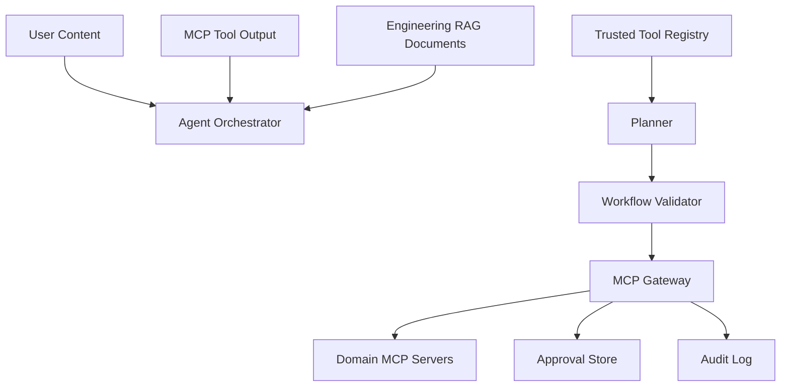

# MCP And Agent Security Threat Model

This threat model covers the MCP Engineering Operations Platform as an AI/MCP control plane. It does not cover general cybersecurity SOC detection or external attack classification.

## Assets

- MCP tool registry and tool metadata
- MCP gateway authorization, policy, rate-limit, idempotency, and approval controls
- Workflow plans, workflow execution checkpoints, and approval records
- User roles, permissions, and server-side authentication context
- Device, ticket, documentation, CI/CD, deployment, and audit data returned by tools
- Engineering knowledge RAG corpus, chunks, citations, and retrieved evidence
- Prometheus metrics and structured logs
- LLM prompts, tool subsets, tool outputs, and agent traces

## Trust Boundaries

Trusted:

- backend policy metadata
- server-side authenticated role
- MCP gateway authorization decisions
- approval records stored by the gateway

Untrusted:

- user request text
- LLM planner output
- MCP tool descriptions from untrusted servers before validation
- MCP tool outputs
- engineering knowledge documents and retrieved RAG chunks
- model-supplied authorization, risk, approval, or environment fields

## Attack Vectors And Mitigations

| Attack vector | Mitigation |
| --- | --- |
| Malicious tool descriptions | Tool registration validates names, server ids, descriptions, fingerprints, trust level, duplicate identities, and suspicious instruction-like text. |
| Tool metadata poisoning | Every tool gets a metadata fingerprint. Conflicting duplicate identities are rejected. Unexpected metadata changes can be detected by comparing fingerprints. |
| Unauthorized tool calls | MCP gateway authenticates server-side tokens, checks RBAC, policy, tool enabled state, rate limits, and idempotency before dispatch. |
| Argument manipulation | Gateway strips untrusted `actor_role`, `approval_token`, `risk_level`, and `required_permission`, then validates trusted arguments against domain schemas. Workflow execution rechecks policy immediately before each node. |
| Prompt injection through tool output | Tool outputs are wrapped as `UNTRUSTED_TOOL_OUTPUT`. Suspicious text increments prompt-injection metrics. Prompts separate trusted instructions, user content, and retrieved tool data. |
| Prompt injection through RAG documents | Retrieved chunks are wrapped as `UNTRUSTED_RETRIEVED_EVIDENCE`, suspicious instruction-like text is flagged, and workflow policy remains authoritative. |
| Privilege escalation | AI/model supplied authorization is ignored. Roles come from server-side authentication. Policy evaluates role and environment at planning and execution time. |
| Approval bypass or replay | Approvals are bound to tool, arguments hash, actor, optional workflow id, optional node id, expiration, and approval status. Mismatches are rejected and counted. |
| Hallucinated tools | Workflow validation rejects nonexistent or undiscovered tool ids and increments hallucinated-tool metrics. |
| Sensitive information leakage | Structured logging sanitizes sensitive keys and common secret patterns. Tool output wrappers sanitize values before prompt context. |
| Unsafe cross-environment actions | Policy is environment-aware and revalidated immediately before execution. Production operations require stricter policy and approval behavior. |

## Metrics

- `mcp_security_events_total`
- `mcp_tool_metadata_rejections_total`
- `mcp_hallucinated_tool_calls_total`
- `mcp_argument_validation_failures_total`
- `mcp_prompt_injection_detections_total`
- `mcp_approval_replay_attempts_total`

## Residual Risks

Prompt injection cannot be perfectly prevented with text filtering alone. The platform treats detection as layered risk reduction, not a proof of safety. The durable enforcement controls are registry validation, gateway authorization, schema validation, policy evaluation, approval binding, idempotency, and audit.

Future production hardening should add signed MCP server manifests, tenant-scoped tool registry approvals, out-of-band metadata review, stronger environment/resource ownership checks, and external SIEM forwarding for control-plane security events.
